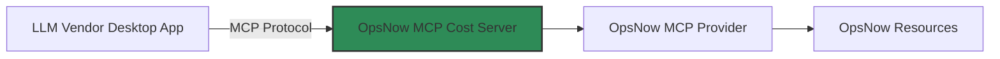

# OpsNow MCP Cost Server

## 소개
OpsNow MCP(Module Context Protocol) Cost Server는 Claude Desktop App과 같은 MCP Client에 OpsNow의 비용 데이터를 제공하는 서버입니다.

## 시스템 구조


- **LLM Vendor Desktop App**: Claude와 같은 LLM 기반 데스크톱 애플리케이션
- **OpsNow MCP Server**: Asset 및 Cost 데이터를 MCP 형식으로 제공하는 서버
- **OpsNow MCP Provider**: OpsNow API Bridge를 통해 자원 데이터를 처리
- **OpsNow Resources**: 실제 OpsNow 리소스 데이터를 가정한 목데이터로 구현 (개발 및 테스트 목적)

## 주요 기능

- MCP 프로토콜을 통한 데이터 제공
- OpsNow 비용 데이터 실시간 제공
- MCP Client와의 효율적인 통신

## 기술 스택

- Node.js
- TypeScript
- MCP SDK (@modelcontextprotocol/sdk)
- dotenv
- zod
- node-fetch

## 설치 방법

```bash
# 저장소 클론
git clone [repository-url]

# 의존성 설치
npm install

# 환경 변수 설정
cp .env

# 빌드
npm run build
```


## 개발 환경 설정

### 필수 요구사항

- Node.js 18.x 이상
- npm 9.x 이상
